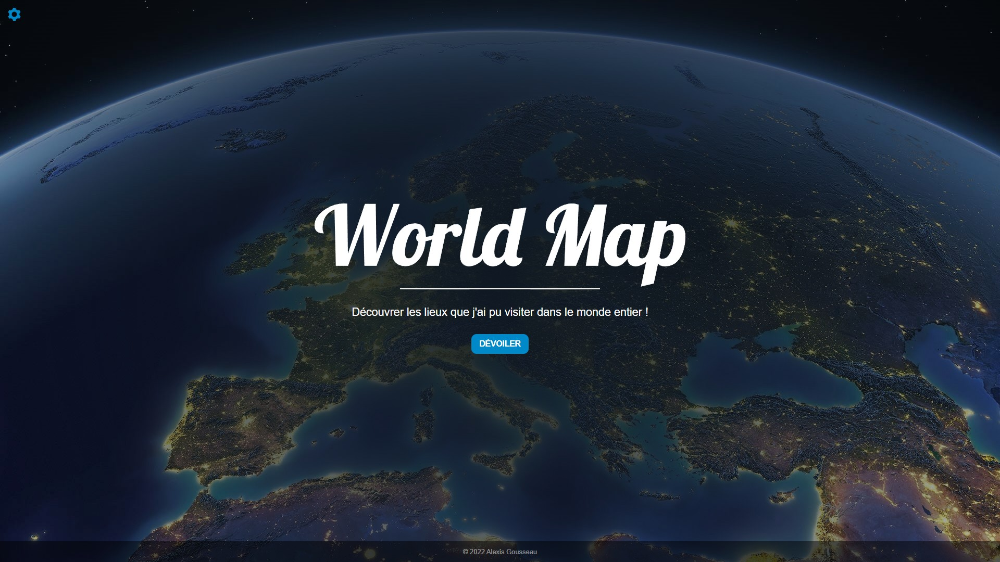

# Worldmap

---

 

### Github repository of my Worldmap project available at this address : [worldmap.alexis-gousseau.com](https://worldmap.alexis-gousseau.com).

 

---

### You can contact me on my website : [alexis-gousseau.com](https://www.alexis-gousseau.com).

